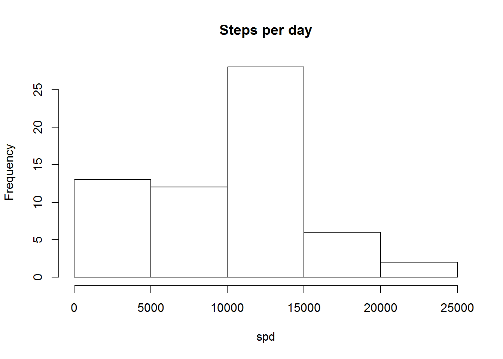
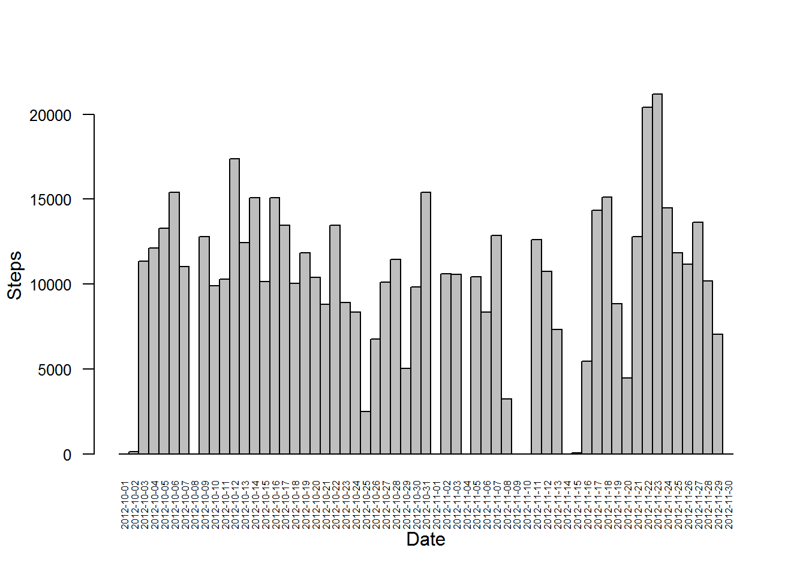
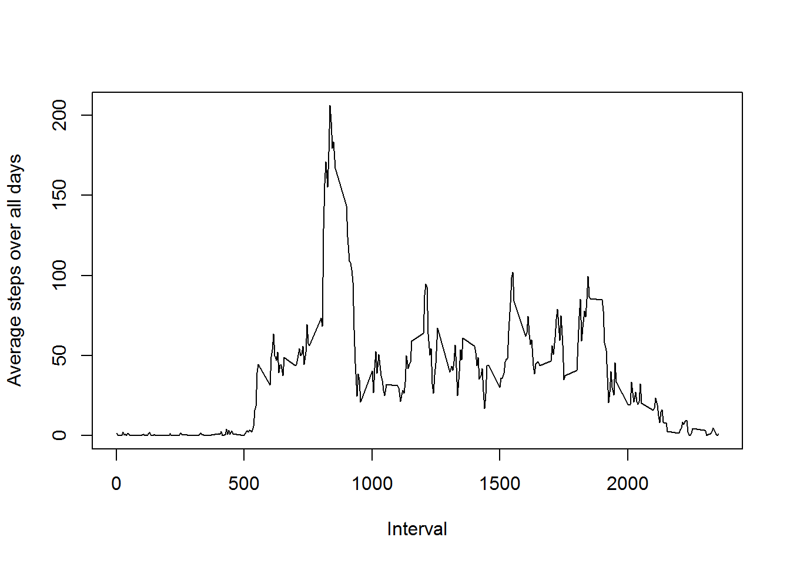
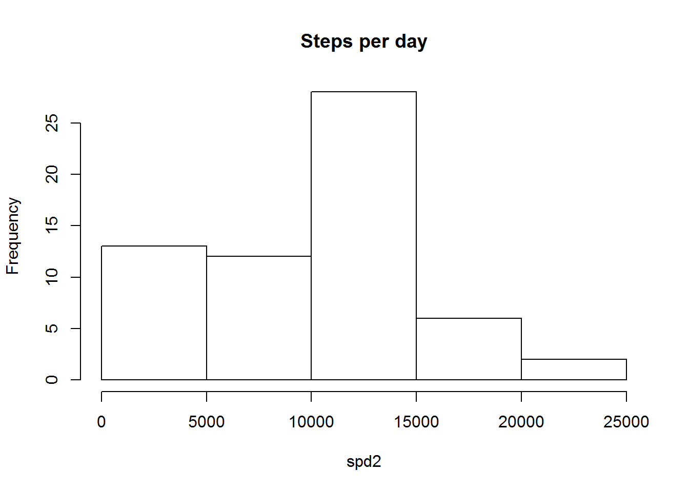
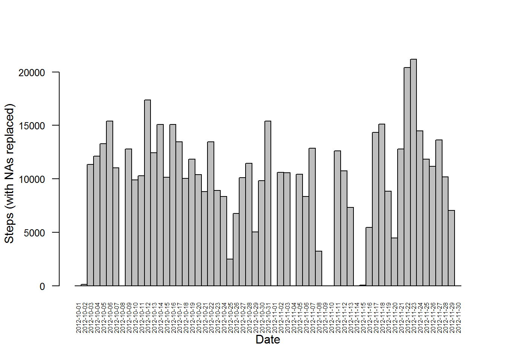
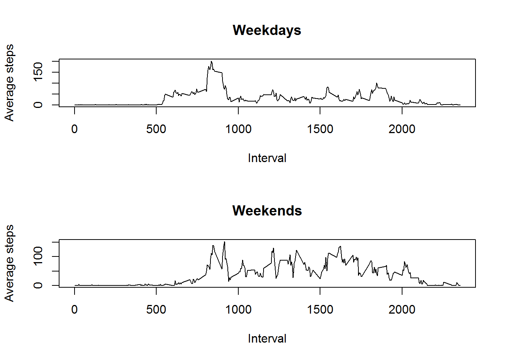

##Loading and preprocessing the data


* Load the data


```r
activity <- read.csv("activity.csv")
summary(activity)
```

```
##      steps                date          interval     
##  Min.   :  0.00   2012-10-01:  288   Min.   :   0.0  
##  1st Qu.:  0.00   2012-10-02:  288   1st Qu.: 588.8  
##  Median :  0.00   2012-10-03:  288   Median :1177.5  
##  Mean   : 37.38   2012-10-04:  288   Mean   :1177.5  
##  3rd Qu.: 12.00   2012-10-05:  288   3rd Qu.:1766.2  
##  Max.   :806.00   2012-10-06:  288   Max.   :2355.0  
##  NA's   :2304     (Other)   :15840
```


##What is mean total number of steps taken per day?

Missing values in the dataset are ignored.

* Total number of steps taken per day


```r
#Calculate the total number of steps per day.
spd <- tapply(activity$steps, activity$date, sum, na.rm = TRUE)
```

* Histogram of the total number of steps taken each day


```r
hist(spd, main = "Steps per day")
```



```r
barplot(spd, las = 2, space = 0, cex.axis = .8, cex.names = 0.5, xlab = "Date", ylab = "Steps")
```



* Mean and median of the total number of steps taken per day


```r
mean <- mean(spd)
median <- median(spd)
```
* Mean: 9354.2295082
* Median: 10395

##What is the average daily activity pattern?

* Time series plot of the 5-minute interval (x-axis) and the average number of steps taken, averaged accros all days (y-axis)


```r
spd1 <- tapply(activity$steps, activity$interval, mean, na.rm = TRUE)
```


```r
plot(names(spd1), spd1, type = "l", xlab = "Interval", ylab = "Average steps over all days")
```



* Which 5-minute interval, on average across all the days in the dataset, contains the maximum number of steps?


```r
max <- names(which.max(spd1))
max
```

```
## [1] "835"
```
The maximum value is in the interval 835. 


##Imputing missing values

There are a number of days/intervals where there are missing values (coded as NA). The presence of missing days may introduce bias into some calculations of the data.

* Total number of missing values in the dataset


```r
missing <- sum(is.na(activity$steps))
```
The number of missing values is 2304.

* The missing values can be filled using the mean/median of the day on which the missing value appears


```r
#Check to see if there are missing values
for (i in 1:length(activity$steps)) {
    #if there is one, it is replaced with the mean of the day divided by the total of intervals.
    if (is.na(activity$steps[i])) {
        activity$steps[i] <-  spd[activity$date[i]] / length(activity$steps[activity$date == activity$date[i]])
    }
}
```

* New dataset, histogram, mean and median


```r
spd2 <- tapply(activity$steps, activity$date, sum)
```


```r
hist(spd2, main = "Steps per day")
```



```r
barplot(spd2, las = 2, space = 0, cex.axis = .8, cex.names = 0.5, xlab = "Date", ylab = "Steps (with NAs replaced)")
```



```r
options(scipen=999)
```


```r
mean <- mean(spd2)
median <- median(spd2)
```

* Mean with NAs replaced: 9354.2295082
* Median with NAs replaced: 10395

The mean and median remain the same, because NA values were replaced with the mean.


##Are there differences in activity patterns between weekdays and weekends?

* Creating a  new factor variable in the dataset with two levels - "weekday" and "weekend" indicating whether a given date is a weekday or weekend day.


```r
#Change the locale to english so that the weekdays function works (my system language isn't english)
Sys.setlocale("LC_ALL","English")
```

```
## [1] "LC_COLLATE=English_United States.1252;LC_CTYPE=English_United States.1252;LC_MONETARY=English_United States.1252;LC_NUMERIC=C;LC_TIME=English_United States.1252"
```

```r
#Change dates from factor to Date
activity$date <- as.Date(activity$date)
#Add a factor variable for weekday and weekend
activity$weekday <- as.factor(rep("weekday",length(activity$date)))
levels(activity$weekday) = c("weekday","weekend")
activity$weekday[weekdays(activity$date) == "Saturday" | weekdays(activity$date) == "Sunday"] <- "weekend"
```

* Panel plot containing a time series plot of the 5-minute interval (x-axis) and the average number of steps taken, averaged across all weekday days or weekend days (y-axis).


```r
#Calculate the mean for every interval
aggdata <- with(activity, aggregate(steps, by = list(interval, weekday), FUN = mean))
par(mfrow = c(2,1))
#Weekday plot
plot(unique(aggdata$Group.1), aggdata$x[aggdata$Group.2 == "weekday"], xlab = "Interval", ylab = "Average steps", main = "Weekdays", type = "l")
#Weekend plot
plot(x = unique(aggdata$Group.1), y = aggdata$x[aggdata$Group.2 == "weekend"], xlab = "Interval", ylab = "Average steps", main = "Weekends", type = "l")
```


